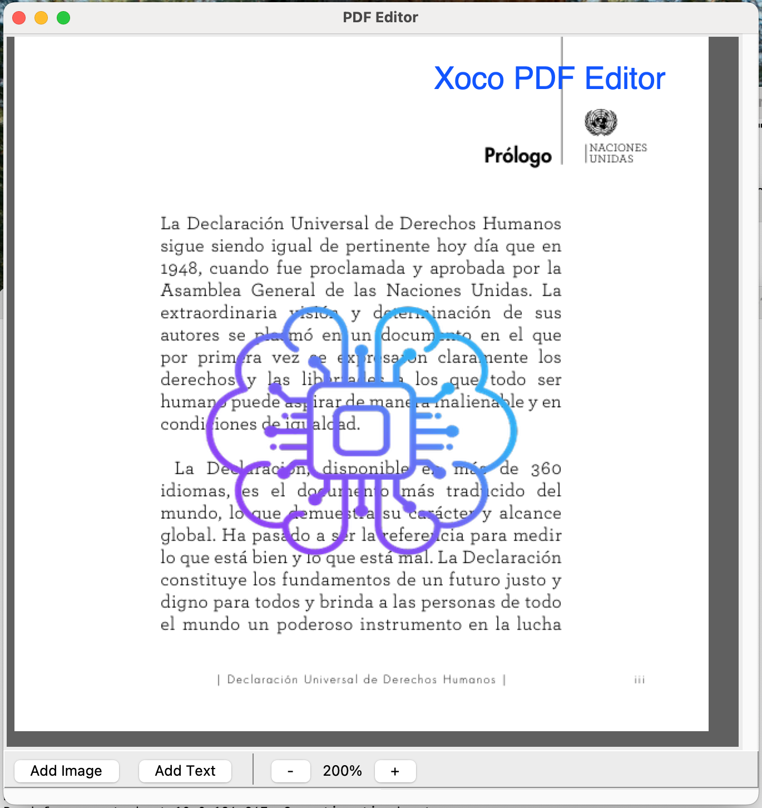

# Xcoco PDF Editor



Are you tired of searching for PDF editors that are either paid, have limited free use, or add annoying watermarks?
Me too!

That's why I created this project with a coding vibe.

A simple PDF editor you can freely use and adapt. It basically allows you to do just two things:

- Add text to the PDF
- Add images to the PDF

It also includes options to load a PDF, download the edited version, zoom in/out, undo your last action, and open the PDF in your default viewer to print.

Feel free to use it!

---

A simple PDF editor built with Python, Tkinter, and PyMuPDF (fitz). This application allows you to open PDF files, add images and text, and save the changes to a new PDF.

## Features

- **Toolbar for Quick Access**: Easily access common actions like adding images, text, and zooming.
- **Add Images**: Place PNG images anywhere on a page.
- **Add Text**: Add text with customizable font, size, and color.
- **Zoom Functionality**: Zoom in and out with buttons and see the current zoom level.
- **Undo**: Revert the last action.
- **View to Print**: Opens the edited PDF in your default viewer to print or save.
- **Keyboard Shortcuts**: Speed up your workflow with keyboard shortcuts.

## Usage

Run the application with the following command:

```bash
python pdf_editor.py
```

- Use the **Toolbar** or the **Edit menu** to add images or text.
- Use the **Toolbar** or the **View menu** to zoom.
- Use **File > View to Print...** to open the PDF for printing.

### Keyboard Shortcuts

| Action          | macOS     | Windows/Linux |
| :-------------- | :-------: | :-----------: |
| Add Image       | `Cmd + I` | `Ctrl + I`    |
| Add Text        | `Cmd + T` | `Ctrl + T`    |
| Zoom In         | `Cmd + +` | `Ctrl + +`    |
| Zoom Out        | `Cmd + -` | `Ctrl + -`    |
| Undo            | `Cmd + Z` | `Ctrl + Z`    |
| Cancel Action   | `Escape`  | `Escape`      |

## Prerequisites

- Python 3.x
- `pip` package manager

## Installation

1.  **Clone the repository:**
    ```bash
    # Replace with your repository URL
    git clone https://github.com/xococodeyo/xocopdfeditor.git
    cd xocopdfeditor
    ```

2.  **Create and activate a virtual environment:**
    *   **macOS/Linux:**
        ```bash
        python3 -m venv venv
        source venv/bin/activate
        ```
    *   **Windows:**
        ```bash
        python -m venv venv
        .\venv\Scripts\activate
        ```

3.  **Install the required packages:**
    ```bash
    pip install -r requirements.txt
    ```

## Project Structure

- `pdf_editor.py`: The main application script containing all the logic.
- `requirements.txt`: A list of Python dependencies for the project.
- `.gitignore`: Specifies intentionally untracked files to ignore.
- `README.md`: This file.
